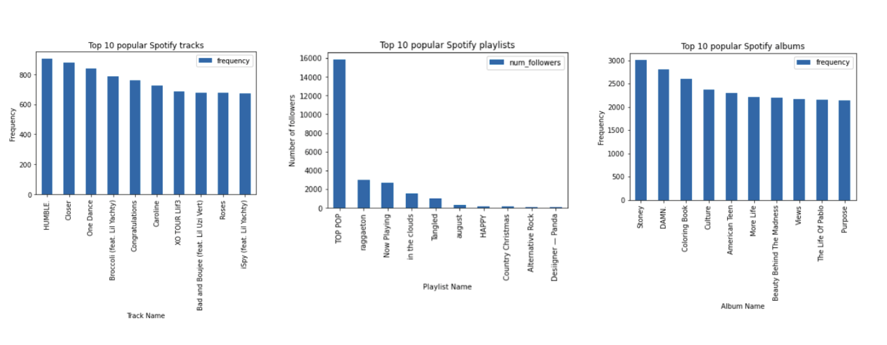
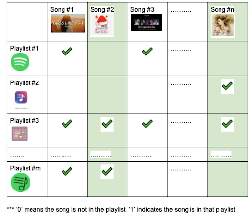
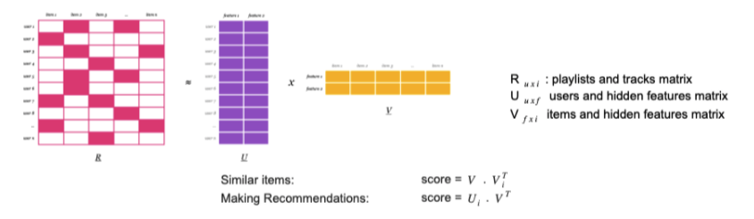
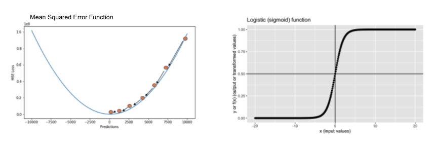
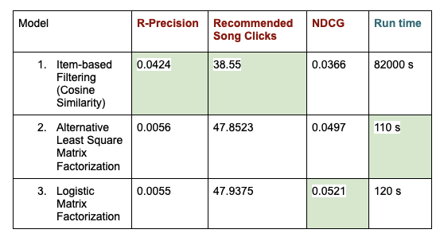

# Spotify-Music-Recommendation

## Outline
1. [Overview and Context](#Overview-and-Context)
2. [Dataset](#Dataset)
3. [Explore Data Analysis (EDA)](#Explore-Data-Analysis-EDA)
4. [Modeling (Cosine Similarity and Matrix Factorization)](#Modeling-Cosine-Similarity-and-Matrix-Factorization)
5. [Evaluation Metrics](#Evaluation-Metrics)
6. [Results](#Results)
7. [Business Suggestions](#Business-Suggestions)

## Overview and Context

Nowadays music is an essential part of people’s lives. Streaming services deliver that music, but they also present more song choices than anyone can sort through. Recommendation systems help users narrow down these choices, and find their future favorites.

Our goal: Develop a competitive music recommendation system, to fill user playlists with relevant songs, and improve user experience and retention.

## Dataset

The dataset contains 1,000,000 playlists, including playlist titles and track titles, created by users on the Spotify platform between January 2010 and October 2017. The dataset includes playlist information such as playlist name, pid, number of albums… and track information such as track name, artist name, track_uri, duration..... A single file that holds many JSON files of Spotify playlists and its track information and can be downloaded through ALcrowd website

## Explore Data Analysis (EDA)

* Out of 20,000 playlists, there are 1.3 million tracks, but only 260k unique tracks.
* In average, each playlist is around 3 hours, and has 50 songs from 30 artists.
* The most popular track is “HUMBLE”, the most popular playlist is “TOP POP”, and the most popular album is “Stoney”.

## Modeling (Cosine Similarity and Matrix Factorization)

Two types of models:
1. Cosine similarity, where new tracks are discovered and ranked based on mutual inclusion in playlists.
2. Matrix factorization, which builds a user-item matrix
    * Alternating Least Squares (ALS)
    * Logistic Matrix Factorization (LMF)
    
    
### Cosine Similarity

New tracks are discovered and ranked based on mutual inclusion in playlists.
This technique gives:
* A real number range [0, 1] indicating how similar two songs are.
* 0.0 means the songs are in completely different playlists, 1.0 means the songs are included in all the same playlists.

### Matrix Factorization

Matrix Factorization finds two matrices U and V in order to make the equation R ≈ U x V to be as perfect as possible. 
Based on the similarity scores for items, the system can make recommendations.

#### ALS vs LMF
ALS uses Mean Squared Error as its loss function, while LMF uses a logistic function that represents probabilities of tracks appearing in the playlist.

## Evaluation Metrics

**R-Precision**: this metric rewards total number of retrieved relevant tracks (regardless of the order)

**Recommendation Song Clicks**: is the number of refreshes needed before a relevant tracks is encountered

**Normalized Discounted Cumulative Gain (NDCG)**: indicates out of recommendation songs, how close the recommendation songs are in the beginning of the hidden list.

## Results 

## Business Suggestions

Although cosine similarity has better results, matrix factorization is 100 to 1,000 times faster.
* I suggest streaming services use matrix factorization methods for real time music recommendations, on user home screens.
* Businesses with strong data processing capacity can implement cosine similarity to refine recommendations over time, or when accuracy is a priority, such as marketing campaigns.
